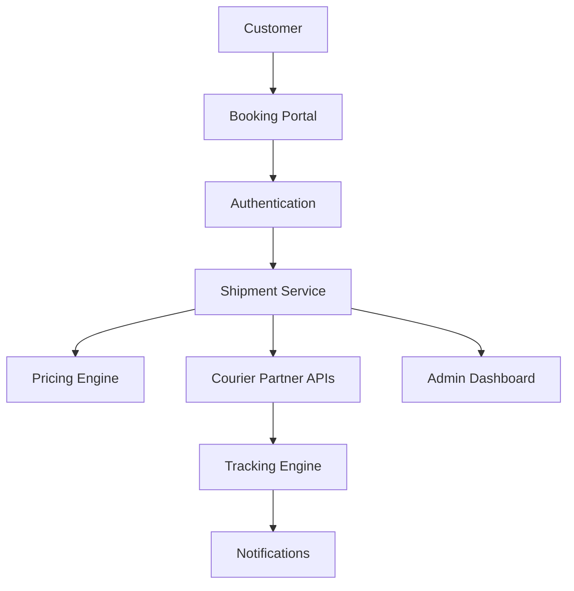
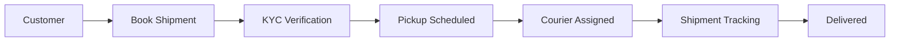
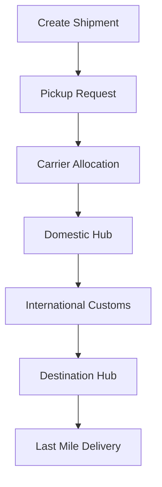

🚚 CourierX — Person-to-Person Courier Booking Platform

Doorstep courier booking platform for domestic and international shipments.
Send medicines, documents, gifts, and parcels across India and to 150+ countries with real-time tracking and doorstep pickup.

🌐 Live Demo: CourierX

✨ Features
🚪 Doorstep pickup scheduling
🌍 Domestic & International shipping
📍 Live shipment tracking
💳 Secure online booking
📦 Multi-carrier support
💊 Medicine courier support
📄 Document shipping
🎁 Gift & parcel delivery
📱 Mobile-first responsive UI
🔒 KYC & compliance-ready workflow

🏗️ Architecture
## 🏗️ Architecture

Workflow

📦 Shipping Flow

📈 Highlights

🌎 Ship to 150+ countries

🚚 Pickup across 19,000+ Indian pincodes

📦 Multi-carrier integration

🔐 Secure online booking

📍 Real-time shipment tracking

📱 Responsive user experience
MIT License
